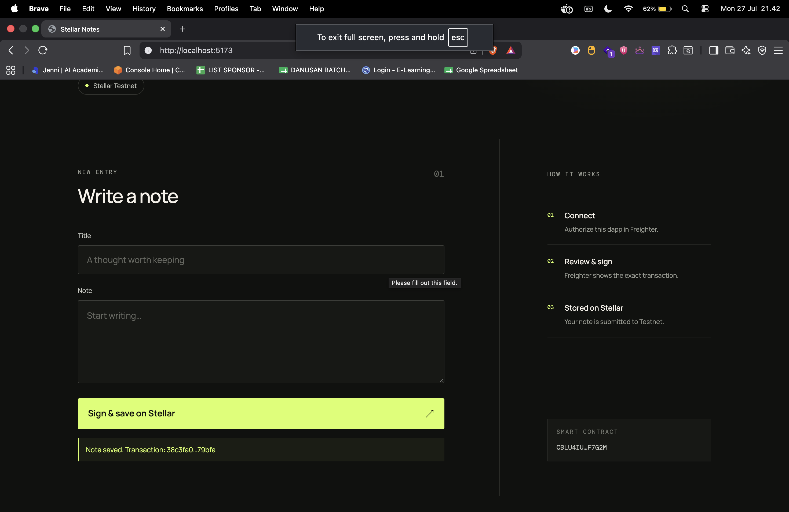
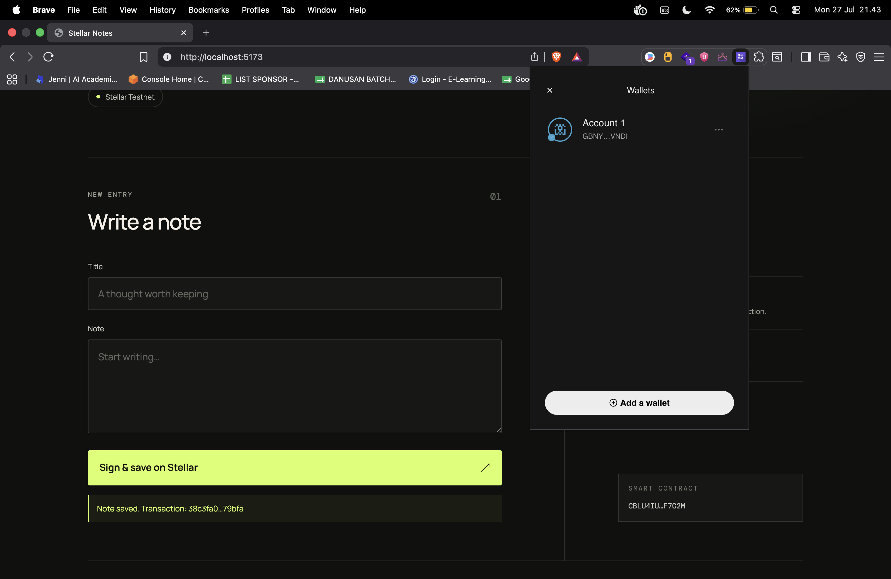
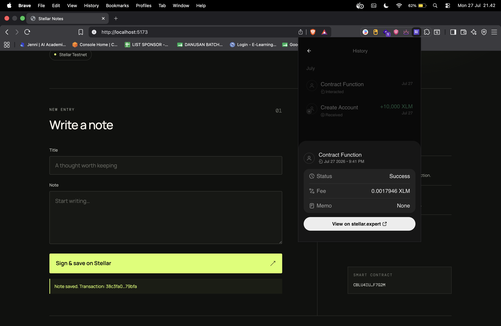

# Stellar Notes DApp

**Stellar Notes DApp** - Blockchain-Based Decentralized Note-Taking System

This repository contains both the Soroban smart contract and a browser dapp
with a real [Freighter](https://www.freighter.app/) wallet connection.

## Live Demo

The application is deployed on Vercel:

**https://notes-project-one.vercel.app/**

> Use Freighter on Stellar Testnet. Testnet XLM has no real-world monetary
> value.

## Screenshots

### Connected DApp and Transaction Result

The connected wallet can authorize a note transaction, and the resulting
transaction confirmation is displayed directly in the application.



### Connected Freighter Account

The application is connected to the selected Freighter Testnet account.



### Successful Soroban Testnet Transaction

Freighter reports the submitted smart-contract invocation as successful and
provides a link to Stellar Expert.



## Wallet Integration

The frontend uses `@stellar/freighter-api` and `@stellar/stellar-sdk` to:

- detect whether the Freighter browser extension is installed (`isConnected`)
- request explicit dapp permission (`setAllowed`)
- retrieve the selected public address (`getAddress`)
- verify that Freighter is connected to Stellar Testnet (`getNetworkDetails`)
- build, prepare, and sign a Soroban transaction (`signTransaction`)
- submit the signed transaction through Stellar RPC

No secret key is requested or stored by this application. The user reviews and
approves every signature inside Freighter.

## Run the DApp

Requirements: Node.js 20.19+ and the Freighter browser extension configured for
Stellar Testnet.

```bash
yarn install
cp .env.example .env
yarn dev
```

Open the local URL printed by Vite, click **Connect wallet**, approve the
permission in Freighter, then create a note and approve the transaction.

The default contract ID and RPC endpoint are included in `.env.example`. They
can be replaced after redeploying the contract:

```env
VITE_CONTRACT_ID=YOUR_DEPLOYED_CONTRACT_ID
VITE_RPC_URL=https://soroban-testnet.stellar.org
```

## Project Description

Stellar Notes DApp is a decentralized smart contract solution built on the Stellar blockchain using Soroban SDK. It provides a secure, immutable platform for managing personal notes directly on the blockchain. The contract ensures that your data is stored transparently and is only manageable through predefined smart contract functions, eliminating reliance on centralized database providers.

The system allows users to create, view, and delete notes, leveraging the efficiency and security of the Stellar network. Each note is uniquely identified and stored within the contract's instance storage, ensuring data persistence and reliability.

## Project Vision

Our vision is to revolutionize personal productivity in the digital age by:

- **Decentralizing Data**: Moving note-taking from centralized servers to a global, distributed blockchain
- **Ensuring Ownership**: Empowering users to have complete control and ownership over their digital thoughts and information
- **Guaranteeing Immutability**: Providing a permanent, tamper-proof record of notes that cannot be altered or deleted by third parties
- **Enhancing Privacy**: Leveraging blockchain security to protect personal information from unauthorized access
- **Building Trustless Systems**: Creating a platform where data integrity is guaranteed by code, not by company promises

We envision a future where digital information is truly personal and sovereign, empowering individuals with complete autonomy over their digital assets.

## Key Features

### 1. **Simple Note Creation**

- Create notes with just one function call
- Specify title and content for each note
- Automated ID generation for unique identification
- Persistent storage on the Stellar blockchain

### 2. **Efficient Data Retrieval**

- Fetch all stored notes in a single call
- Structured data representation for easy frontend integration
- Quick access to your entire note collection
- Real-time synchronization with the blockchain state

### 3. **Secure Deletion**

- Remove specific notes using their unique IDs
- Permanent removal from the contract storage
- Clean and efficient storage management
- Immediate update of the note list after deletion

### 4. **Transparency and Security**

- View all note activities on the blockchain
- Blockchain-based verification of all storage actions
- Immutable records of note creation and deletion
- Protected against unauthorized modifications

### 5. **Stellar Network Integration**

- Leverages the high speed and low cost of Stellar
- Built using the modern Soroban Smart Contract SDK
- Scalable architecture for growing note collections
- Interoperable with other Stellar-based services

## Contract Details

- Contract Address: CBLU4IUASQ4WUMOXBFLZRSBBLILGOH33GS4LUPKFBCCCMJCDQNMF7G2M
  (Screenshot has been removed)

## Future Scope

### Short-Term Enhancements

1. **Note Encryption**: Support for end-to-end encryption of note content for enhanced privacy
2. **Category Management**: Add tags and categories to organize notes efficiently
3. **Rich Text Support**: Extend support beyond plain text to include Markdown and formatted content
4. **Search Functionality**: Implement advanced search filters for large note collections

### Medium-Term Development

5. **Collaborative Notes**: Implement multi-signature requirements for shared or collaborative note-taking
   - Shared access for multiple addresses
   - Permission-based editing and viewing
   - Version history tracking
6. **Notification System**: Off-chain bridge to alert users of new updates or shared notes
7. **Asset Attachment**: Capability to attach digital assets or tokens to specific notes
8. **Inter-Contract Integration**: Allow other smart contracts to interact with and store data in the notes contract

### Long-Term Vision

9. **Cross-Chain Synchronization**: Extend note storage to multiple blockchain networks
10. **Decentralized UI Hosting**: Host the frontend on IPFS or similar decentralized platforms
11. **AI-Powered Summarization**: Optional integration with AI to help users summarize their notes
12. **Privacy Layers**: Implement zero-knowledge proofs for completely private note content
13. **DAO Governance**: Community-driven protocol improvements and feature prioritization
14. **Identity Management**: Integration with decentralized identity (DID) systems for user management

### Enterprise Features

15. **Corporate Documentation**: Adapt the system for secure corporate record-keeping
16. **Immutable Logging**: Create time-locked logs for audit purposes
17. **Automated Reporting**: Automatic note triggers for periodic reporting
18. **Multi-Language Support**: Expand accessibility with internationalization

---

## Technical Requirements

- Soroban SDK
- Rust programming language
- Stellar blockchain network

## Getting Started

Deploy the smart contract to Stellar's Soroban network and interact with it using the three main functions:

- `create_note()` - Create a new note with a title and content
- `get_notes()` - Retrieve all stored notes from the contract
- `delete_note()` - Remove a specific note by its ID

---

**Stellar Notes DApp** - Securing Your Thoughts on the Blockchain
